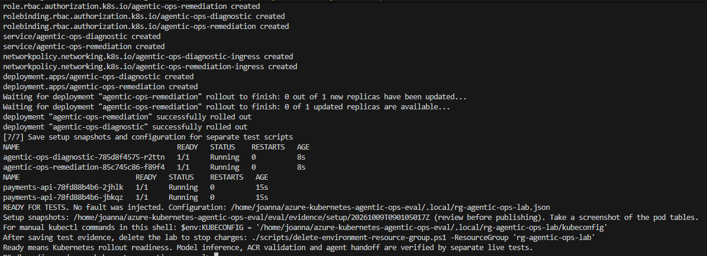

# Azure Kubernetes Agentic Ops — Evaluation

A two-agent AKS proof of concept for LLM-assisted diagnosis and policy-controlled
remediation of container image-reference errors. This repository contains the
application, scenario checks and evidence from live evaluation runs.

**The model proposes; deterministic policy authorizes; execution is verified.**

## How it works

| Agent | Responsibility |
| --- | --- |
| Diagnostic | Observe image-pull failures, collect Kubernetes evidence and request a structured model proposal. |
| Remediation | Check the proposal against a fixed policy and ACR, update the affected container image and verify rollout health. |

The agents run as separate workloads with separate Kubernetes permissions and
Azure Workload Identities. Python code coordinates the workflow; Azure OpenAI
provides inference. The internal handoff is token-authenticated and restricted
by ingress NetworkPolicy.

Automatic repair is limited to a nearby image-reference correction in the same
allowlisted registry, with exactly one failing container. The current image must
be absent and the proposed image must exist in ACR. A failed check or unsuccessful
recovery ends in escalation for human review.

The evaluation aims to measure correct recovery, safe abstention and response
time. A successful demo alone does not establish a speed advantage over a
deterministic script. See the [evaluation protocol](evaluation-scenarios.md).

## Start the environment

Use **PowerShell 7**, Azure CLI, kubectl and git. Azure Cloud Shell in PowerShell
mode is suitable. The account needs permission to create resources, register
providers and assign roles. Local Docker is not required.

### What the setup script does

- Creates a dedicated `rg-agentic-ops-lab` resource group, one-node AKS with
  Cilium and Workload Identity, Basic ACR and an Azure OpenAI model deployment.
- Configures separate agent identities and resource-scoped permissions, builds
  the agent image in ACR and deploys both agents.
- Imports a demo image and starts a healthy `payments-api` workload
  (nginx under a demo image alias).
- Saves local configuration and kubeconfig under `.local/`, and setup snapshots
  under `eval/evidence/setup/`.

**The script creates billable Azure resources.** It prepares the lab without
injecting faults or running evaluation scenarios. Existing groups without
matching local setup state are refused.

Run each command separately:

~~~powershell
az login
az account list --query "[].{Name:name,SubscriptionId:id}" -o table
git clone https://github.com/JeanneBM/azure-kubernetes-agentic-ops-eval.git
Set-Location azure-kubernetes-agentic-ops-eval
./scripts/setup-environment.ps1 -SubscriptionId '<YOUR_SUBSCRIPTION_ID>'
~~~

Replace the placeholder with your subscription ID. For an existing checkout,
run `git pull --ff-only` from its directory, then the setup command.
Completion prints `READY FOR TESTS`.

### Example setup output

Expected result: both agents and the demo replicas are `Running` and `1/1 Ready`,
followed by `READY FOR TESTS`. This screenshot shows setup completion;
model inference and remediation are checked in separate live trials.
Resource names, paths and Pod identifiers vary between environments.

Load the saved configuration to inspect the lab:

~~~powershell
$config = Get-Content ./.local/rg-agentic-ops-lab.json -Raw | ConvertFrom-Json
$env:KUBECONFIG = $config.kubeconfig
kubectl get pods -n agentic-ops
kubectl get pods -n payments
~~~

To resume interrupted setup, keep the local state and rerun with the same
parameters. Resuming restores the healthy demo baseline; save existing evidence
first. For defaults, parameter overrides and implementation details, read the
[setup script](scripts/setup-environment.ps1) or [setup guide](docs/clean-environment-setup.md).

## Run scenarios and collect evidence

The automated live S01 trial injects `paymnets-api:1.4.2` instead of
`payments-api:1.4.2`, waits for the agent outcome and saves logs and snapshots:

~~~powershell
$registry = ($config.demoImage -split '/')[0]
./scripts/test-s01.ps1 -AcrLoginServer $registry -Kubeconfig $config.kubeconfig
~~~

Run this after loading the setup configuration above. One execution is one
trial. A failed trial can leave the faulty image in place.
See the [live S01 guide](docs/live-s01.md) for exact pass criteria.

Store evidence for every live scenario in
`eval/evidence/<scenario-id>/<UTC-run-id>/`.
Use the [evidence guide](eval/evidence/README.md) and
[run template](eval/evidence/TEMPLATE.md). Preserve failed attempts and review
logs for credentials before publishing.

## Local checks

Python 3.11 or later is required; the container and CI use Python 3.12.

~~~sh
python -m pip install -c constraints.txt -e ".[dev]"
python -m pytest
~~~

Scenario checks use mocked Kubernetes, ACR and model responses. They validate
application behaviour for scripted inputs; live AKS and real-model results are
recorded separately. See [test organization](tests/README.md) and
[scenario validation records](eval/README.md).

## Cleanup

Save and download evidence, then delete the lab:

~~~powershell
az account set --subscription $config.subscriptionId
./scripts/delete-environment-resource-group.ps1 -ResourceGroup 'rg-agentic-ops-lab'
~~~

The script requires the group name as confirmation, waits for deletion, verifies
AKS node groups and removes eligible unused regional Network Watchers plus an
empty NetworkWatcherRG. Shared watchers are preserved. Use your actual group
name if setup used a different one; local files and evidence remain.
See the [cleanup script](scripts/delete-environment-resource-group.ps1).

## Scope and limitations

- One managed namespace and registry; automatic remediation only for image-reference typos.
- Incident state and deduplication are in memory; each agent runs one replica.
- Image-only writes are constrained by application policy, not field-level RBAC.
- Image existence and similarity do not establish service or release intent.
- Rollout readiness does not verify business functionality.
- External egress allowlisting requires cluster-specific configuration.

For architecture details, see [two-agent orchestration](docs/two-agent-orchestration.md)
and [deployment boundaries](docs/two-workload-deployment.md).
